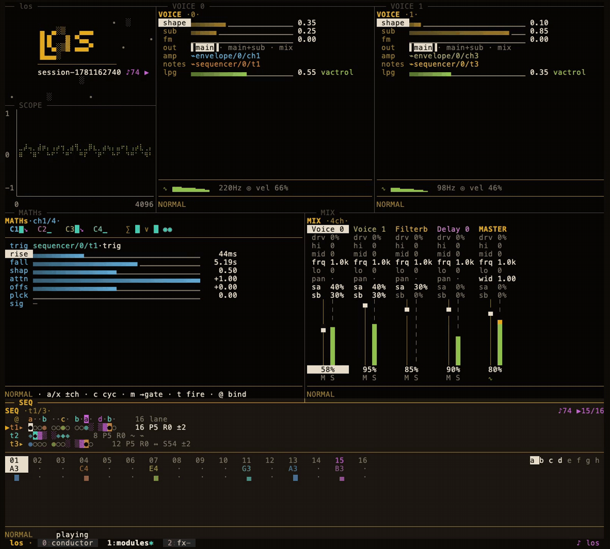

# Los

```
▗▖ ▄▄▄   ▄▄▄
▐▌█   █ ▀▄▄
▐▌▀▄▄▄▀ ▄▄▄▀
▐▙▄▄▖
```

**A modular groovebox that lives in your terminal.** Every module is its own
process in its own tmux pane, wired together over shared memory. Edit
patterns with vi grammar. Patch modulation like a Eurorack. No DAW, no
plugins, no mouse required (but the mouse works too).



## Why this exists

Hardware grooveboxes are joyful because they're *instruments* — dense,
tactile, opinionated. DAWs are powerful because they're software. Los tries
to keep both: the immediacy of a knob-per-function panel, rendered in a
terminal, driven by the text-editing muscle memory you already have.

- **vi is the editing grammar.** `3x` deletes three steps. `yw` yanks a word
  of steps, `p` pastes it. `ct4` changes everything up to step 4. `u` undoes,
  `.` repeats. Visual mode, registers, counts, dot-repeat — the whole kit,
  applied to sequences instead of text.
- **Patching is receiver-side and color-coded.** Any parameter can be bound
  to any output (`@` opens the picker). Every connection gets a cable color,
  and the *same* color shows at both ends — slider and source. Glance at the
  rig and see the patch.
- **The envelope is a [Make Noise Maths](https://www.makenoisemusic.com/synthesizers/maths)
  homage.** Six function generators with 0.5 ms – 25 min times (or literally
  0), analog-shaped vari-response curves, cycling to audio rate, slew
  limiting, EOR/EOC gates for self-patching, and a vactrol-style pluck mode
  for Natural-Gates-grade percussive decays. The voice carries a low-pass
  gate so plucks *thump* instead of click.
- **Processes, not threads.** Each module is a separate OS process talking
  through POSIX shared memory: lock-free audio ring buffers, a multi-consumer
  event ring, a 64-channel modulation bus, a shared transport clock. tmux is
  the window manager. Kill a pane, respawn it, the session heals.

## Quick start

```sh
cargo install --path .   # or: cargo build --release

los        # resume your most recent session
los new    # fresh session, default patch
```

You land in a tmux session with the full rig laid out. `Ctrl-b` + arrows
moves between panes; each pane is one module, focused and keyboard-driven.

First five minutes:

1. Press `Space` — the transport starts everywhere at once.
2. In the **sequencer**, hit `i` for insert mode and tap steps in with
   `Space`; `k`/`j` nudge pitch, `x` deletes, `u` undoes.
3. Try the grammar: `v` select a few steps, `y` yank, move, `p` paste.
4. In **MATHs**, scroll a rise/fall slider with the mouse wheel, or flip a
   channel to cycle (`c`) and you've got an LFO.
5. Bind it: on any voice slider press `@`, pick `envelope/0/ch1`, and watch
   the slider take the cable's color and start breathing.
6. `:w mypatch` saves. `:q` from the conductor tears it all down. `los`
   brings it back.

### Transport, anywhere

| Key | Action |
|-----|--------|
| `Space` | Play/pause from any module pane |
| `Ctrl-b p` / `Ctrl-b s` | Play-pause / stop via tmux prefix |
| `los ctl play\|stop\|toggle\|status` | From any shell or script |

The prefix bindings are scoped to the `los` session — your other tmux
sessions keep stock behavior.

## The modules

| Module | What it does |
|--------|--------------|
| **sequencer** | 8 tracks × up to 128 steps, Euclidean pulses/rotation per track, note + modulation track modes, full vi grammar, scrolling step windows |
| **voice** (`sto`) | STO-style oscillator: waveshaping, sub osc, linear FM, and a vactrol-ish low-pass gate on the amp envelope |
| **envelope** (`maths`) | The Maths homage: 6 channels, trig/gate/cycle, slew, pluck, attenuverters + offsets, SUM/OR/INV mixing, EOR/EOC gates, audio-rate output |
| **mixer** | Auto-discovers every audio source via the manifest, per-track meters, clip warning |
| **scope** | Braille/half-block/bars/dots renderers, level trigger, taps any audio or mod source |
| **conductor** | Session brain: save/load, add/remove modules at runtime, routing overview |
| **badge** | The faceplate. Breathes with the beat, sleeps when you stop. Pure joy, zero DSP |

Everything speaks the same dialect: `hjkl` to move and adjust, counts and
`Shift` for coarse steps, `@` to bind, `u`/`Ctrl-r` to undo/redo, `:` for ex
commands (`:w` / `:e` patches, `:set bpm 124`, `:q`), `?` for help. Mouse
works everywhere it makes sense: wheel to nudge, click to select, drag to
slide. The full reference lives in [docs/keybindings.md](docs/keybindings.md).

## How it's put together

```
sequencer ──events──▶ ┌──────────────┐ ◀──events── (any consumer)
                      │  POSIX SHM    │
voice ──audio ring──▶ │  /los_*       │ ◀──audio ring── envelope
envelope ──modbus──▶  │  manifest     │ ──modbus──▶ voice, scope, …
                      │  transport    │
                      └──────────────┘
                             ▲
            mixer scans the manifest, mixes every ring → speakers
```

- **Manifest** — a registry of running modules with PID liveness checks and
  dead-entry reaping, so crashed panes never wedge the session.
- **Event ring** — multi-consumer SPSC-per-reader note events; consumers that
  die get reaped instead of stalling the writer.
- **Modulation bus** — 64 float channels, allocated dynamically as modules
  claim outputs. Addresses are stable names (`envelope/0/eoc`), not channel
  numbers, so patches survive restarts.
- **Transport** — one shared clock, one playing flag, one BPM. `Space` in any
  pane flips the same bit.

State saves are TOML patches (`:w name`), and `los ps` dumps the live
session — manifest entries, ring lag per consumer, clock — when you want to
see the machinery.

Design goals, the module contract, and the SHM protocol are written up in
[DESIGN.md](DESIGN.md). The visual language (phosphor & ink: bone text, amber
accents, signal-type hues, the color law for cables and pitch) is in
[docs/plans/design-language.md](docs/plans/design-language.md).

## Status

v1 is done and this is it: vi grammar, dynamic routing, the Maths build-out,
undo everywhere, module lifecycle, the design pass, mouse support. The
[roadmap](docs/plans/roadmap.md) sketches what's next: more voices, effects
modules, and orca-inspired sequencer tricks (chance, ratchets, clock
division, swing).

Built in Rust with [ratatui](https://ratatui.rs) + crossterm + cpal. macOS
today (POSIX SHM + tmux; Linux should be close).

## Hacking

There's a [justfile](justfile): `just check` runs clippy (warnings are
errors) and the full test suite, `just build` / `just install` do what they
say, and `just demo` re-records the GIF above with
[vhs](https://github.com/charmbracelet/vhs) (`brew install vhs`). The demo
recipe spins up a real session, lets it play, and tears the session down —
it refuses to run while a live `los` session exists, so it can't eat your
work.

By default the demo records a fresh session and sketches a pattern on
camera. To record *your* rig instead: arrange a session until it looks
right, save it from the conductor under the name `demo`, close the
session, and run `just demo`. Save-states capture the tmux pane layout in
a portable form, so your arrangement reproduces inside the recording
terminal (playing or stopped — the tape starts the transport itself).

## License

TBD
